### 1.1. Инициализация GIT репозитория

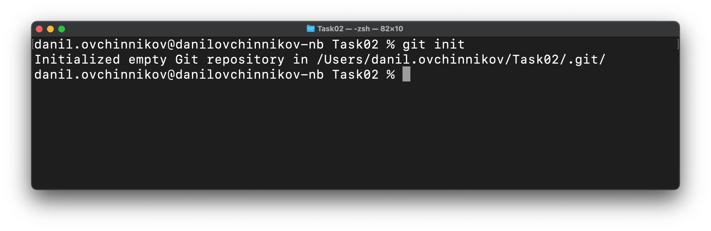

### 1.2. Проверка, что GIT репозиторий сознан

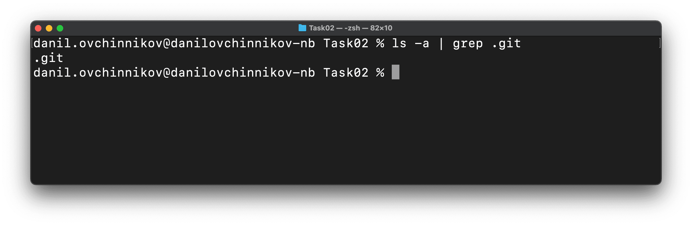

### 2.1. Просмотр содержимого файла конфигурации GIT для текущего репозитория (.git/config)

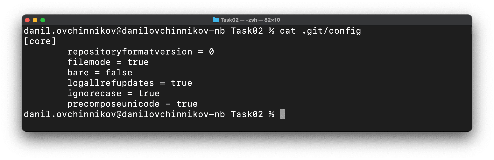

### 2.2. Настройка имени и email пользователя для текущего репозитория

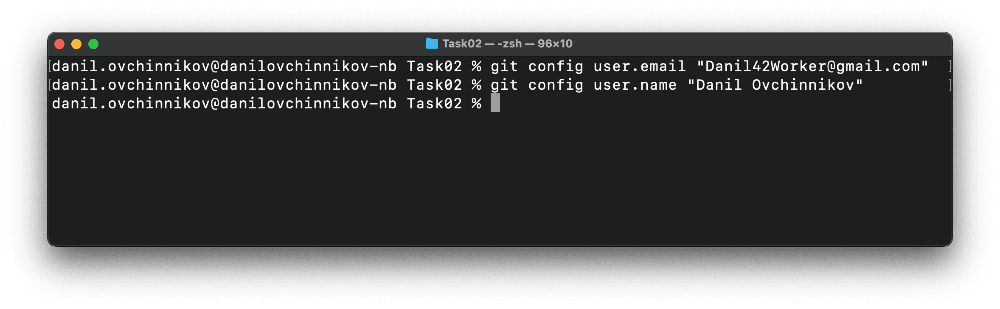

### 2.3. Проверка, что файл .git/config изменился соответствующим образом

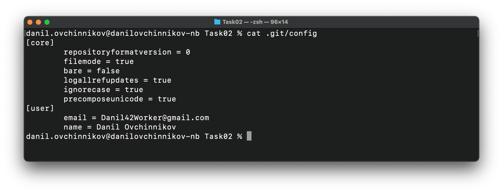

### 3.1. Проверка, что отсутствует файл индекса (.git/index)

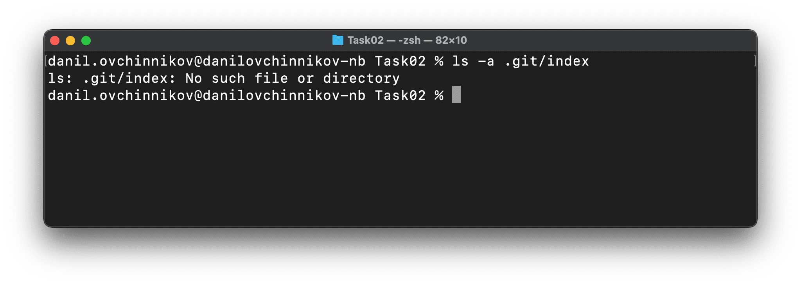

### 3.2. Проверка, что папка с объектами Git пустая (.git/objects)

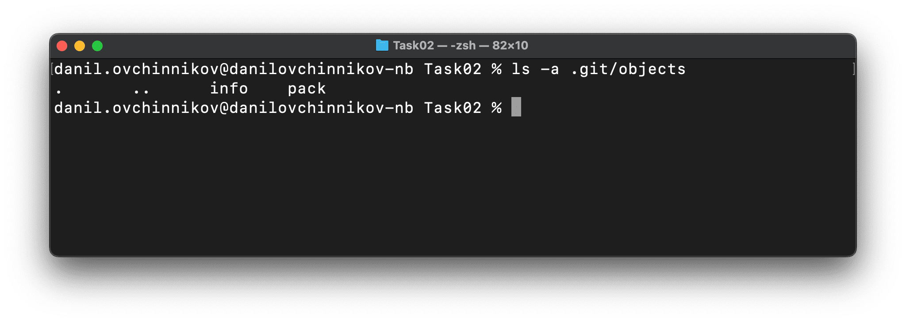

### 3.3. Проверка, что указатель HEAD указывает на ветку main

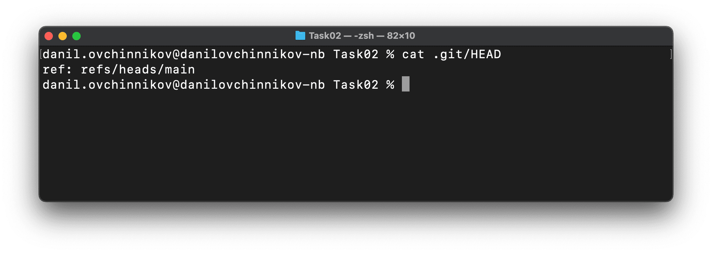

### 4.1. Добавление файлы отслеживаемыми

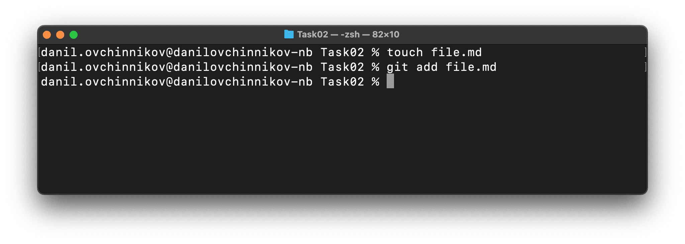

### 4.2. Просмотр на файл индекса (.git/index) и папку с объектами (.git/objects)

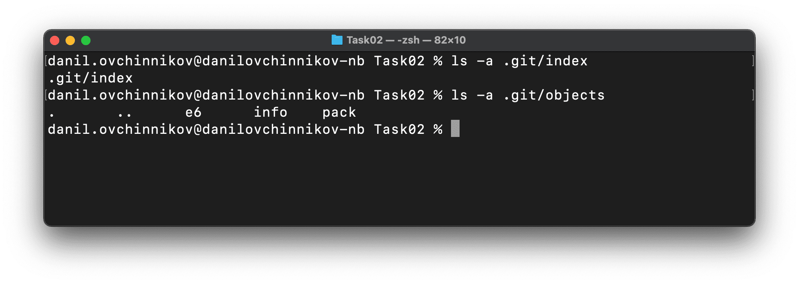

### 4.3. Коммит

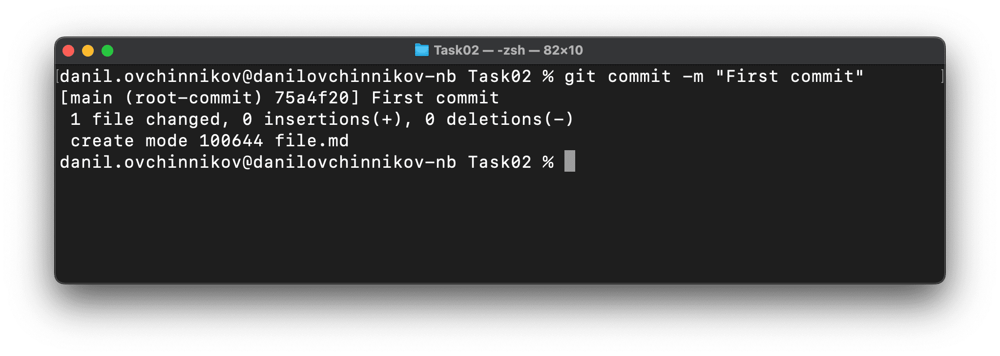

### 4.4. SHA сделанного коммита

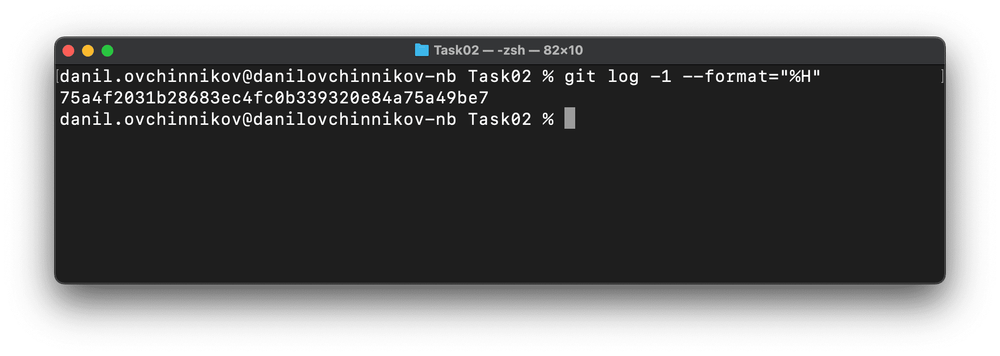

### 5.1. Удаление файла

> GIT отобразил, что файл был удалён

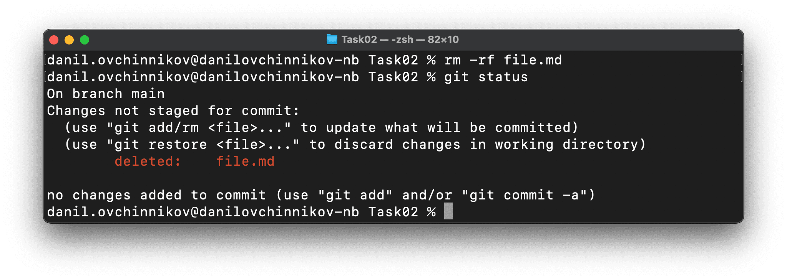

### 5.2.

> GIT восстановил файл. Теперь для GIT'а ничего не произошло

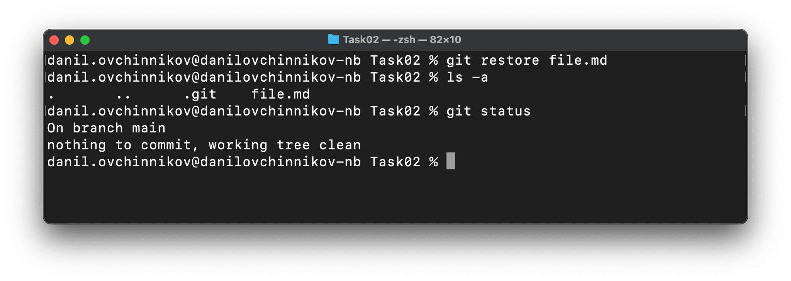

### 5.3. Ещё один коммит

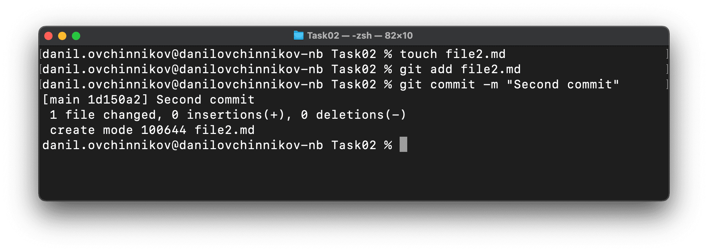

### 5.4. История коммитов

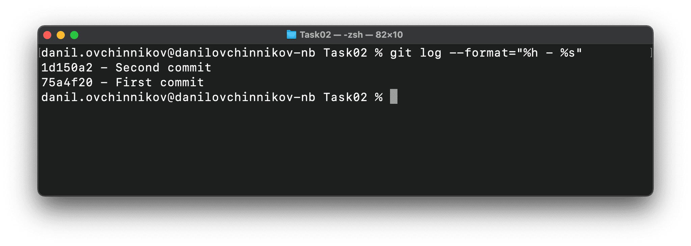
